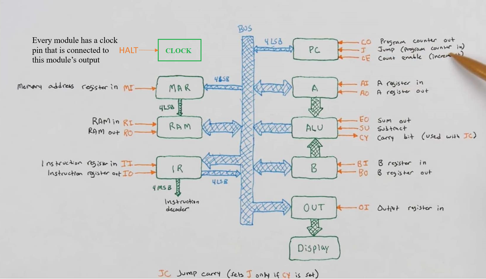
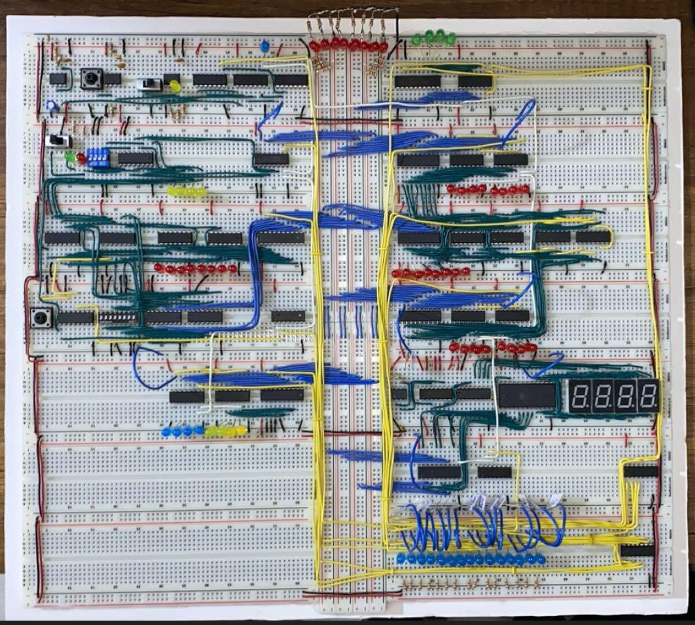

#8-bit Breadboard Computer

This repository documents my build of Ben Eater's 8-bit computer on breadboards. The project follows Ben Eater's design and serves as an educational tool for understanding the fundamentals of computer architecture at the hardware level.

## Project Overview

This 8-bit computer is built using 74LS series TTL logic chips and follows a modular design. It consists of several key components, including:

- **Clock Module**: Generates the clock signal for the system.
- **Program Counter (PC)**: Handles sequential execution of instructions.
- **Memory Module**: Stores and retrieves instructions and data.
- **Instruction Register & Decoder**: Decodes instructions and generates control signals.
- **Arithmetic Logic Unit (ALU)**: Performs basic arithmetic and logic operations.
- **Registers (A & B)**: Temporary storage for data manipulation.
- **Output Display Module**: Displays computed results.

## Current Status

- The core modules of the 8-bit computer have been assembled and wired on breadboards.
- All control signals have been brought to a common location for easier manual control.
- The control logic has not been fully implemented yet, meaning the system currently requires external intervention for executing instructions.

## Images

### 1. Architecture Diagram (Module-Level)

### 2. Physical Breadboard Build

## References

- [Ben Eater's Website](https://eater.net)
- [Ben Eater's YouTube Series on 8-bit Computer](https://www.youtube.com/playlist?list=PLowKtXNTBypGqImE405J2565dvjafglHU)

